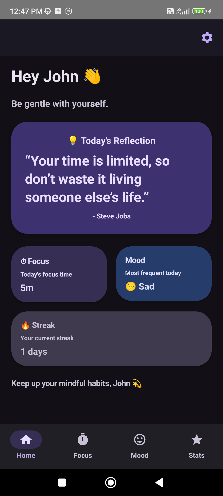
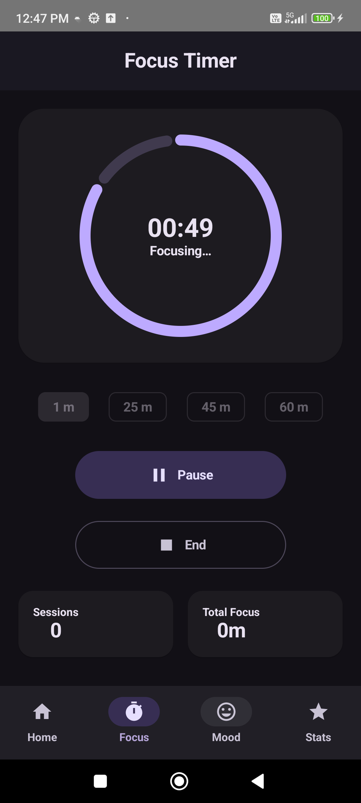
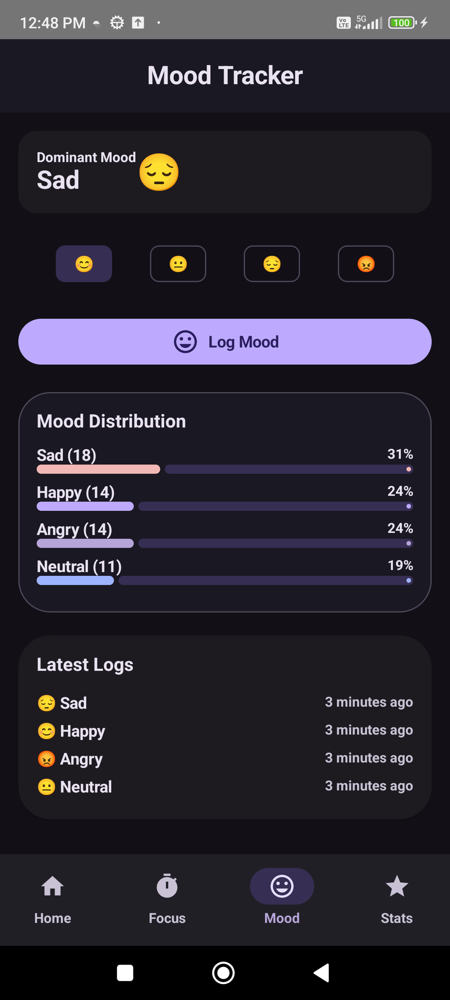
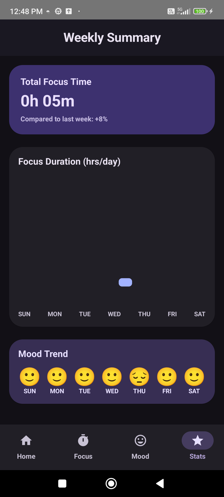
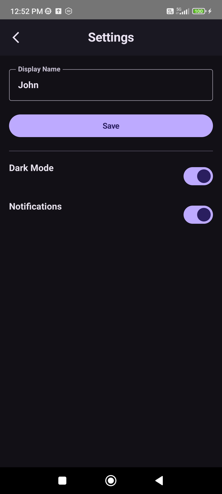
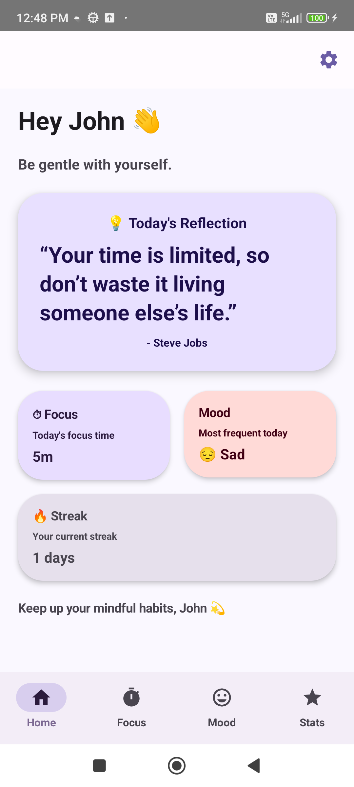
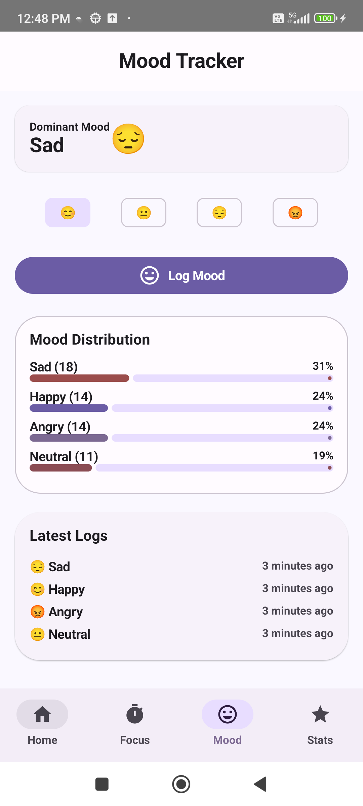
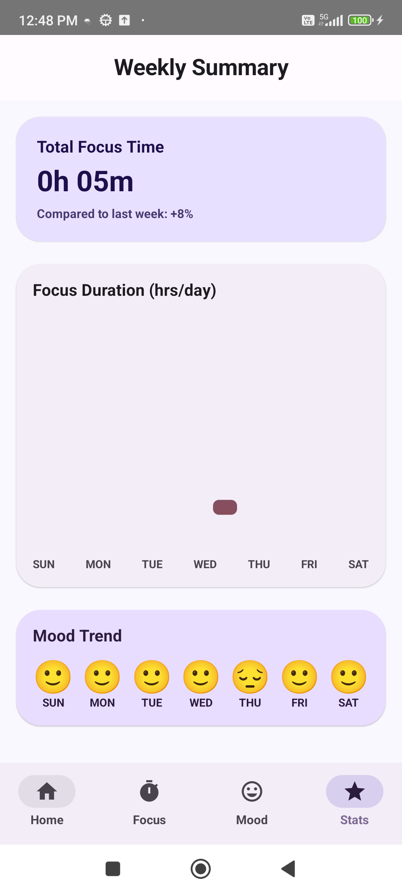
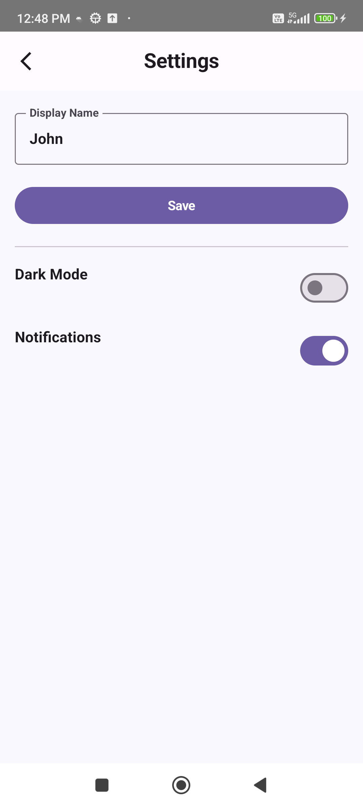

# 🧘‍♀️ MindfulWork — Focus & Mood Tracker App

A **Jetpack Compose-powered Android app** that helps you **track focus sessions, monitor mood patterns**, and reflect on your **emotional well-being** — all in one elegant interface.  
Built with **Clean Architecture, MVVM, Hilt and Room**, this app blends **productivity tracking** with **mindfulness insights**.

---

## ✨ Core Idea

MindfulWork fuses productivity and mindfulness.  
By recording **focus durations** and **mood shifts** throughout your day, it helps you visualize how emotions correlate with your working hours — nudging you toward **healthier, mindful work habits**.

---

## 🧩 Features

### 🔹 Focus Tracking
- Start, pause, or stop **Pomodoro-like focus sessions**
- Auto-log sessions and calculate total weekly focus time
- Visual charts for focus duration trends

### 🔹 Mood Tracking
- Log moods with intuitive emoji-based UI
- View **distribution charts** and dominant moods per day
- Detect shifts in mood across focus sessions

### 🔹 Mindful Dashboard
- Personalized greeting with motivational quotes
- Daily focus time, streak tracking, and mood insights
- Smart summary cards built with Compose Material 3

### 🔹 Stats & Analytics
- Weekly insights: focus vs. mood correlation
- Mood trend visualization with charts
- Streak analysis to build consistent mindfulness

### 🔹 Settings
- Toggle between **Dark / Light mode**
- Update user profile
- Enable/disable notifications (WorkManager-backed reminders)

---

## 🏗️ Architecture

MindfulWork follows **Clean Architecture** with strict separation of concerns.

presentation (UI) → domain (UseCases) → data (Repositories)

### **Layers Overview**

| Layer | Description | Tech Stack |
|-------|--------------|------------|
| **UI / Presentation** | Jetpack Compose screens and ViewModels for each feature | `Compose`, `ViewModel`, `StateFlow`, `Material3` |
| **Domain** | Core business logic and independent use cases | `Kotlin Coroutines`, `UseCase pattern` |
| **Data** | Local + Remote sources, repository implementations | `Room`, `Firebase`, `DataStore`, `Hilt` |

---

## ⚙️ Tech Stack

### **Language & Framework**
- **Kotlin** — Modern, concise, null-safe  
- **Jetpack Compose** — Declarative UI  
- **Material 3** — Dynamic color theming and dark mode  

### **Architecture**
- **MVVM + Clean Architecture**
- **Hilt (Dependency Injection)**
- **Coroutines + Flow** for async and reactive updates  

### **Data**
- **Room Database** for local persistence  
- **Firebase Auth & Firestore** for sync and backup  
- **DataStore Preferences** for settings management  

### **Analytics**
- Custom **focus session logs**  
- **Mood trend visualizations**  
- **Weekly stats aggregation**

---

## 📂 Project Structure
```text
com.poojaps.mindfulwork/
│
├── data/
│ ├── firebase/ # Firebase integrations
│ ├── local/ # Local DB, DAO, Entities
│ ├── prefs/ # DataStore for settings
│ ├── repository/ # Repository implementations
│ └── di/ # Hilt modules
│
├── domain/
│ ├── model/ # Domain models
│ ├── repository/ # Interfaces
│ └── usecase/ # Business logic (Use Cases)
│
├── service/ # Focus timer service and actions
├── ui/
│ ├── components/ # Reusable Compose components
│ ├── screens/ # Home, Focus, Mood, Settings, Stats
│ ├── animation/ # Motion and confetti effects
│ └── theme/ # Light/Dark mode, Typography, Colors
│
└── viewmodel/ # State holders for each screen
```

---

## 🧠 Key Highlights

- 🔸 State-driven **Compose UI architecture**
- 🔸 **Realtime updates** from FocusTimerService using `StateFlow`
- 🔸 Seamless **DataStore integration** for theme & notification settings
- 🔸 Modular **DI setup** using Hilt modules per feature
- 🔸 **Room caching + Firebase sync** to persist focus and mood data
- 🔸 **Weekly insights generation** using domain-layer aggregation

---
## 📸 App Preview

| Mode | 🏠 Home | ⏱️ Focus | 😊 Mood | 📊 Summary | ⚙️ Settings |
|:------|:------:|:------:|:------:|:------:|:------:|
| **🌙 Dark Mode** |  |  |  |  |  |
| **🌞 Light Mode** |  |  |  |  |  |

---

## 🚀 Future Enhancements
- 🔹 Firebase Cloud Authentication and backup for focus history  
- 🔹 Mood prediction with ML Kit  
- 🔹 Smart notifications for mindful breaks  
- 🔹 Widget for quick session start

---

## 🛠️ Run Locally

```bash
git clone https://github.com/pooja-p-s/mindfulwork.git
cd mindfulwork
./gradlew assembleDebug

```

🧾 License
MIT License
Copyright (c) 2025 Pooja P S
---

```

## 👩‍💻 Author

**Pooja Pradeep Simla**  
Software Engineer | Android & Backend Developer  

> *“Code with clarity. Design with empathy. Build for balance.”*

---
